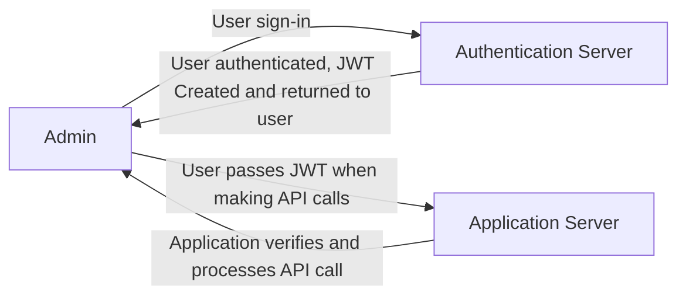
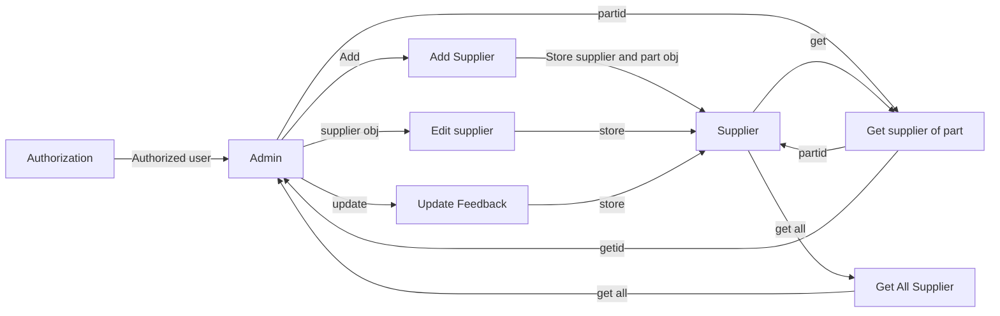
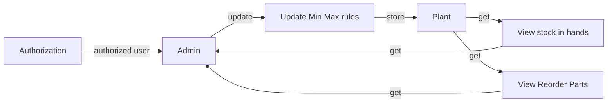
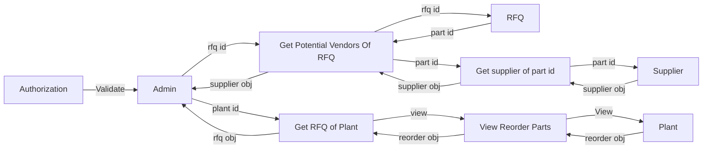

# Manufacturing-RFQ-Management
 
 

**Authorization Module**  
&nbsp;&nbsp;&nbsp;&nbsp; > To create a login page for authentication.  
&nbsp;&nbsp;&nbsp;&nbsp; > Generate JSON Web Token.  
&nbsp;&nbsp;&nbsp;&nbsp; > Service to Service Communication has to happen using JWT. 
&nbsp;&nbsp;&nbsp;&nbsp; > Pass End User Context across Microservices. 
&nbsp;&nbsp;&nbsp;&nbsp; > Token will expire after specific amount of time ( 15 minutes ). 
 
 

**Supplier Microservice**  
&nbsp;&nbsp;&nbsp;&nbsp; > Add suppliers and supplier parts.  
&nbsp;&nbsp;&nbsp;&nbsp; > Edit the details of the supplier and supplier parts.  
&nbsp;&nbsp;&nbsp;&nbsp; > Update the feedback of the supplier based on the parameters they supply.  
&nbsp;&nbsp;&nbsp;&nbsp; > Get all the supplier and supplier part details. 
 
 

**Plant Microservice**  
&nbsp;&nbsp;&nbsp;&nbsp; > View stock in hand of a given part as of current date.  
&nbsp;&nbsp;&nbsp;&nbsp; > View reorder point of any part as of current date.  
&nbsp;&nbsp;&nbsp;&nbsp; > Update the Min Quantity/ Max Quantity of the part based on assembly demands of the plant.  
&nbsp;&nbsp;&nbsp;&nbsp; > Min Quantity - If a stock reduces to this number a reorder is essential. 
&nbsp;&nbsp;&nbsp;&nbsp; > Max Quantity - The largest numbers to meet the demand. 
 
 

**RFQ Microservice**  
&nbsp;&nbsp;&nbsp;&nbsp; >RFQ of a plant must be calculated based on the response from plant microservice on the parts that needs reorder.  
&nbsp;&nbsp;&nbsp;&nbsp; > Potential vendors have to be returned by reaching the supplier service who has good feedback to supply the given part based on the feedback rating.  

 
 

