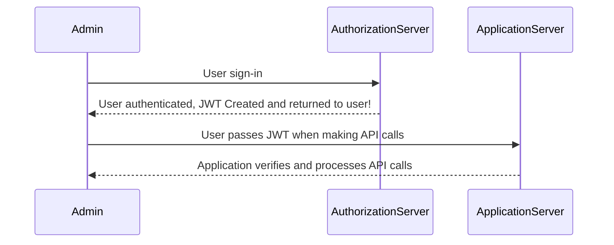

# Manufacturing-RFQ-Management
 
 

**Authorization Module**  
&nbsp;&nbsp;&nbsp;&nbsp; > To create a login page for authentication.  
&nbsp;&nbsp;&nbsp;&nbsp; > Generate JSON Web Token.  
&nbsp;&nbsp;&nbsp;&nbsp; > Service to Service Communication has to happen using JWT. 
&nbsp;&nbsp;&nbsp;&nbsp; > Pass End User Context across Microservices. 
&nbsp;&nbsp;&nbsp;&nbsp; > Token will expire after specific amount of time ( 15 minutes ). 
 
 

		

